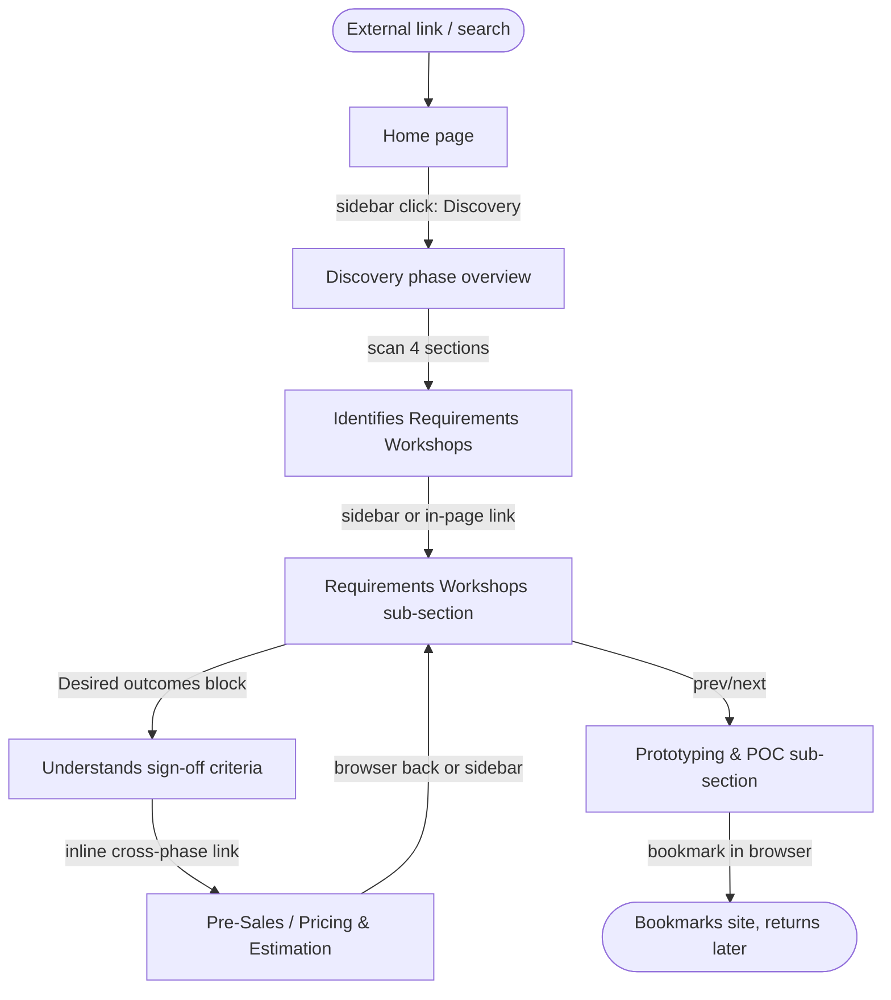
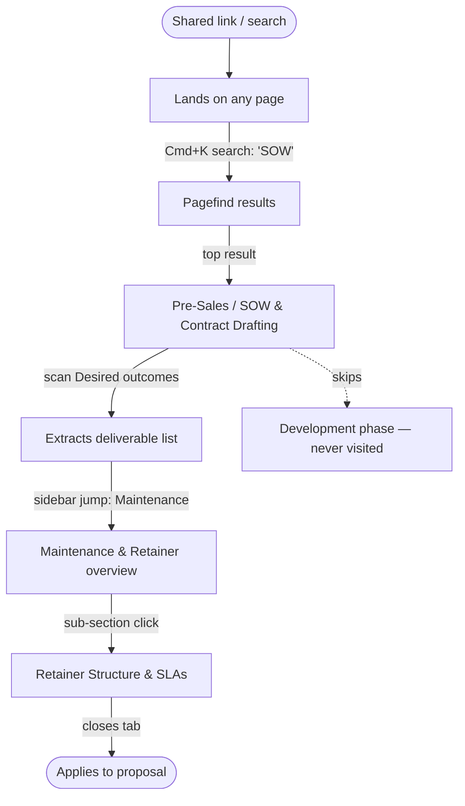
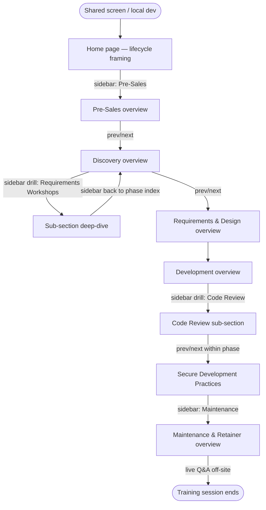

# UX Design Specification Software Development with AI

**Author:** Ferdi
**Date:** 2026-04-23

---

## Executive Summary

### Project Vision

A free static reference site that makes the invisible agency/consulting delivery lifecycle visible for senior engineers entering client-facing work. The product is its content; the UX job is to render the lifecycle with enough structural weight that the sidebar itself teaches the shape of the work, and to make every one of 43 pages feel consistent, scannable, and authoritative.

### Target Users

- **Marcus — New Consulting Engineer (primary, success path).** Senior backend dev on his first consulting engagement. Navigates sequentially by phase, uses the site to understand what happens in meetings he's never run before, and crosses between phases to understand handoffs.
- **Priya — Freelancer Scaling Up (primary, edge case).** 3-year freelancer quoting larger engagements. Cherry-picks phases relevant to her immediate problem (Pre-Sales, Discovery, Maintenance) and skips Development. Every page must stand alone.
- **Ferdi — Trainer.** Uses the site as the spine of live training sessions for junior-to-mid engineers. Walks through phase overviews top-to-bottom and drills into specific sub-sections on demand. The page structure is his training outline.

All users are technically strong but process-light. Primary device: desktop. Secondary: mobile, for in-the-field reference during active client work.

### Key Design Challenges

1. **Phase-overview vs. sub-section differentiation** (FR17) — same 4-section template, different roles; visual hierarchy must signal which kind of page you're on without breaking template consistency.
2. **Sidebar as lifecycle map** — the sidebar has to render the 7-phase ordering with enough structural weight that users read it as a mental model, not just navigation.
3. **Cross-phase handoff patterns** (FR16) — linking forward and backward between phases is core to Marcus's journey; the pattern needs to support this without cluttering the 4-section page template.
4. **Dual-mode reading** — supporting both cherry-picking (Priya) and sequential training (Ferdi) with the same content; page length, in-page TOC, and repetition rhythm all pull in both directions.
5. **v2-ready interactive content slot** — v1 visual system must accommodate dynamic diagrams and islands in v2 without re-theming; needs to answer where interactive components sit on the page and how they degrade.

### Design Opportunities

1. **The sidebar as signature UX.** The lifecycle-first sidebar is the product's strongest differentiator made visible — phase numbering, grouping, and current-location cues can make it a map, not a menu.
2. **Template repetition as teaching scaffold.** The 4-section rhythm across 43 pages trains readers in the shape of professional delivery; visual design (consistent H2 treatment, predictable page length, optional per-section iconography) can reinforce the learning rhythm.
3. **Practitioner aesthetic as brand.** A clean Starlight-native docs look with confident second-person voice and zero decorative imagery differentiates sharply from both academic (Coursera) and sales-y (bootcamp) alternatives.

## Core User Experience

### Defining Experience

The core loop is **orient → find → read → act**: a user arrives knowing roughly which phase of a client engagement they're in (or wants to understand the shape of the whole lifecycle), navigates to the relevant page, reads the four structured sections, and leaves with a concrete mental model of what to produce, what "done" looks like, and what comes next. Every feature — sidebar, search, prev/next, dark mode, page template — exists to make this loop fast and repeatable. The site succeeds when a reader can execute this loop in under a minute.

### Platform Strategy

Browser-only, static HTML/CSS/JS served from GitHub Pages. Primary platform is desktop (Chrome/Firefox/Safari/Edge latest two major versions) with mouse/keyboard input; secondary is mobile browser with touch. No native apps, no offline mode, no device-specific APIs. Responsive range 320px–2560px. Mobile is treated as a reference context (consultant pulling up the site between meetings), not a long-form reading context — design for fast tap-to-answer.

### Effortless Interactions

1. **Locating yourself in the lifecycle.** Sidebar + page header together tell the reader the current phase, current sub-section, and where both sit in the 7-phase flow — at a glance, without scrolling.
2. **Finding the sign-off / done criteria.** *Desired outcomes* section on every page is scannable and visually anchored — Marcus prepping for a meeting reaches it in seconds.
3. **Moving between phase overview and sub-sections, and between sibling sub-sections.** Sidebar + prev/next make sequential training feel page-flip-smooth.
4. **Searching and landing on the right page.** Pagefind full-text search with previews that include page title and first-line of *What happens here* — minimum cognitive load to confirm the match.
5. **Dark/light mode toggle.** Starlight default; no thought required.

### Critical Success Moments

- **First 10 seconds on the home page.** The visitor must immediately grasp: "this is the agency consulting lifecycle, here are the 7 phases, pick one." The sidebar is the hero; marketing copy does not lead.
- **First sub-section page visit.** The 4-section rhythm must feel structured and navigable, not dense. If H2s blur together or the page reads as a wall of prose, the template's teaching value collapses.
- **First cross-phase link click.** Navigating from a Discovery page into a linked Pre-Sales page must feel instant and contextual — the destination stands alone, and returning is obvious.
- **First mobile tap.** Sidebar opens cleanly, target phase is one tap away, page body reads without pinch-zoom. Mid-meeting reference use depends on this.

### Experience Principles

1. **The sidebar is the product.** The agency-lifecycle structure is the product's core differentiator made visible. Every design decision that adds structural weight to the sidebar wins; decisions that de-emphasize it lose.
2. **Scannable before readable.** All three primary users skim — for outcome criteria, for a specific phase, for training beats. Content must be parseable by H2 structure, section anchors, and callouts; linear-only readability is a failure mode.
3. **Consistency is the feature.** The 4-section rhythm across 43 pages is the teaching scaffold. Visual design reinforces the rhythm — identical H2 treatment, predictable page length, predictable section order — never varies for novelty.
4. **Mobile is reference, not reading.** Mobile is for mid-meeting lookups. Design for fast orientation, not immersive reading — tight sidebar collapse, tappable headings, compact page headers.
5. **Zero decoration, maximum clarity.** Practitioner voice demands a practitioner aesthetic. No stock imagery, no gradients, no decorative hero sections. Typography, spacing, and the sidebar carry the visual identity.

## Desired Emotional Response

### Primary Emotional Goals

The defining emotion the site must produce is **competence** — the quiet feeling of "I know what I'm doing now." A senior engineer arrives feeling out of their depth on the process side of client delivery and leaves with a concrete mental model of what to produce, what "done" looks like, and what comes next. Competence is the emotion that converts a first-time consulting engineer into someone who walks into a client meeting with a plan; it is also what brings them back as a reference during active delivery.

### Emotional Journey Mapping

| Stage | Marcus (new consultant) | Priya (cherry-picker) | Ferdi (trainer) |
|---|---|---|---|
| Discovery (landing) | Relief — "this is actually about what I need" | Recognition — "this has the bits I care about" | Validation — "this is teachable as-is" |
| Core loop (reading a page) | Grounding — "okay, this is what I produce" | Efficiency — "straight to the part I need" | Confidence — "clear enough to present from" |
| Cross-phase navigation | Orientation — "this connects to Pre-Sales" | Non-friction — "glanced, moved on" | Authority — "this is the throughline I teach" |
| Return visit | Trust built — bookmarks, returns per phase | Habit — "my reference for the business side" | Ownership — "this is my training spine" |
| Failure mode (unclear content) | "Probably my gap, not the site's" — held up by consistent structure | "I'll skip ahead" — held up by page independence | "I'll fill this with my own story" — held up by cleanly-scoped content |

### Micro-Emotions

**Targeted:**
- Confidence over confusion
- Trust over skepticism
- Orientation over disorientation
- Respect (practitioner-to-practitioner) over condescension
- Quiet authority over performative expertise

**Actively avoided:**
- Overwhelm — 43 pages could feel like homework; cherry-pick-friendliness and page rhythm must defuse this
- Marketed-to feeling — no hero CTAs, no "Welcome! Let's get started" copy
- Uncertainty about location — losing track of phase/page role breaks trust
- Visual noise — decorative iconography, colors, or callouts degrade the practitioner aesthetic

### Design Implications

- **Competence** → scannable *Desired outcomes* block on every page; explicit "definition of done"; concrete deliverables named; no hedging language in content
- **Trust** → typography chosen for authority, zero stock imagery, visible last-updated dates, no popups, no sign-up gates, no tracking that betrays a media-property feel
- **Orientation** → sidebar always visible on desktop, breadcrumb + page title prominence, phase numbering in sidebar, clear visual differentiation between phase overview and sub-section pages (FR17)
- **Respect** → second-person practitioner voice enforced in content guidelines, no gamification or progress indicators, no beginner-framed explainers before main content
- **Quiet authority** → restrained palette (Starlight default + at most one accent), generous whitespace, predictable page rhythm, no motion/animation beyond framework defaults
- **Anti-overwhelm** → home page frames non-linear reading explicitly; phase overview pages carry scannable summaries so cherry-pickers can enter mid-lifecycle with context

### Emotional Design Principles

1. **Restraint is the aesthetic.** Every element on the page must be load-bearing; decoration erodes trust.
2. **Treat the reader as a peer.** No beginner framing, no affirmations, no progress gamification. Practitioner-to-practitioner tone in both copy and layout.
3. **Make location always obvious.** Disorientation is the most corrosive micro-emotion for a reference site; visual hierarchy must always answer "what phase am I in, and what kind of page am I on?"
4. **Let structure do the reassurance.** The 4-section rhythm, repeated across 43 pages, produces competence through predictability — visual design reinforces the rhythm rather than varying it.
5. **No marketing voice, anywhere.** The site is a reference, not a product launch. Copy, imagery, and interaction patterns all hold this line.

## UX Pattern Analysis & Inspiration

### Inspiring Products Analysis

Reference targets are all established technical documentation sites, chosen because the product IS a technical documentation site and the primary users already use these every day. The brief explicitly names `docs.astro.build` as the preferred style reference.

- **docs.astro.build** (preferred reference, brief-confirmed). Sidebar IA, in-page TOC, breadcrumb, prev/next, command-palette search, dark/light toggle — all the navigation patterns we inherit via Starlight. Tone is calm, confident, unpretentious. Zero hero marketing on inner pages.
- **Stripe Docs.** Gold-standard for "reference material that reads as authored." Strong typographic rhythm, sparing use of accent color, callouts used only for genuinely important asides (not decoration). The feeling of "someone serious wrote this" is exactly the trust signal this site needs.
- **Tailwind CSS Docs.** Demonstrates how tight typography + generous whitespace + predictable repetition across hundreds of pages can make a reference site feel both exhaustive and scannable. The template-per-page consistency is the exact model for our 4-section rhythm.
- **MDN Web Docs.** Authority through neutrality — no branding flair, just consistently formatted reference. Good model for the "quiet authority" emotional goal.
- **Linear documentation.** Demonstrates minimal but modern docs aesthetic; clean sidebar with section weighting that we can emulate for phase-level grouping.

**Negative reference:** `roadmap.sh` — excellent community product but a very different pattern (interactive skill trees, gamified "mark as done" state). Our site is deliberately the opposite: static reference, no progress state, no personalization, no signup.

### Transferable UX Patterns

**Navigation patterns (inherit via Starlight):**
- Persistent left sidebar with nested groups — directly supports FR1–FR2, FR7.
- Breadcrumb showing Section › Phase › Page — FR4.
- Prev/next at the bottom of every page, scoped by sidebar order — FR3, FR19, supports Ferdi's sequential training flow.
- In-page TOC on the right (desktop) and collapsible at top (mobile) — supports Marcus's scan-for-outcome-criteria behavior.
- Command-palette search (keyboard shortcut `/` or `Cmd+K`, powered by Pagefind) — FR6.

**Content patterns:**
- Callout blocks (Aside) for genuinely important notes — "watch out for this" moments in best-practices content.
- Code blocks with clipboard copy — only needed for the handful of sub-sections that include CLI snippets (DevOps, Repository Structure).
- Tables for structured comparisons (e.g. "what leading agencies do" side-by-side).
- Numbered step lists (Starlight `<Steps>`) for any sign-off/outcome procedures.
- Mermaid diagrams for lifecycle-handoff visuals (v1 minimal; v2 expands with dynamic diagrams per the NFR4 revision).

**Visual patterns:**
- System font stack (no custom webfont) — reinforces "quiet authority" and keeps first paint fast.
- Neutral palette with one restrained accent — consistent with practitioner aesthetic.
- Sparing color — color earns its place by carrying meaning, never decoration.
- Generous line-height (1.6+) and comfortable max-line-width (~75ch) — long-form reference reads well.

### Anti-Patterns to Avoid

- **Marketing hero on the home page.** No "Welcome to your journey," no centered hero illustration, no call-to-action button. The home page is a concise framing + the sidebar made prominent.
- **Newsletter popups / signup gates / "join the community" banners.** The site collects nothing and sells nothing; any widget suggesting otherwise betrays the practitioner tone.
- **AI chat widget or floating "ask me" bubble.** Undermines the "I know what I'm doing" competence goal by positioning the site as incomplete.
- **Gamified progress indicators** ("3 of 35 pages complete," streaks, badges). Treats the reader as a student instead of a peer.
- **Stock illustrations / 3D characters / gradient backgrounds.** The aesthetic the brief rejects — bootcamp marketing, not reference material.
- **Content reveals / accordions for the main 4 sections.** The template's visibility is the teaching scaffold; hiding sections behind clicks breaks it.
- **"Related articles" carousels.** Cross-phase links are already inline and contextual; a sidebar carousel is clutter.
- **Autoplay animations or scroll-triggered reveals.** Violates the "no motion beyond framework defaults" principle.

### Design Inspiration Strategy

**Adopt:**
- Starlight's full navigation stack (sidebar, breadcrumb, prev/next, in-page TOC, Pagefind search) — all FRs covered, no custom nav code needed.
- Stripe-style typographic restraint — system fonts, strong H2 rhythm, neutral color.
- Tailwind-docs-style template repetition — same 4-section rhythm on every page reinforces trust.

**Adapt:**
- Starlight sidebar default → extend with **explicit phase numbering** (`1. Pre-Sales & Business Development`, `2. Discovery`, etc.) so the lifecycle ordering is visible as a map, not discoverable through reading.
- Starlight Aside callouts → map to consulting-specific semantics (`tip` = best-practice, `caution` = common mistake, `note` = deliverable/outcome anchor) without inventing new visual primitives.
- Starlight home template → strip the default hero; replace with a short "how to use this site" framing plus an immediate phase list.

**Avoid:**
- Anything from the marketing-docs playbook: hero sections, testimonial cards, newsletter bars, "get started" CTAs, feature grids.
- Anything from the bootcamp/course playbook: progress bars, badges, "continue where you left off," gamification.
- Custom theming that overrides Starlight's accessibility defaults (contrast, focus states, reduced-motion).

## Design System Foundation

### Design System Choice

**Chosen system: Starlight's built-in design system** (framework-provided via Astro Starlight, per the architecture decision).

This is the concrete UX-layer answer to the architectural selection — the framework ships with a coherent, accessible, responsive design system sized exactly for technical documentation. No external component library (Material, Ant, Chakra, MUI) is adopted; no custom design system is built from scratch. Starlight's tokens, components, and templates are the foundation.

### Rationale for Selection

- **Alignment with architecture.** Architecture already selected Starlight. Introducing a second design system would conflict with the existing component pipeline and re-theme work it into a hybrid that loses Starlight's built-in navigation and search integrations.
- **Alignment with emotional goals.** Starlight's defaults are restrained, practitioner-leaning, and information-dense — exactly the "quiet authority / zero decoration" principles defined in step 4. Swapping in Material or Ant would inject product-UI flavor that works against the reference-site aesthetic.
- **Alignment with effort model.** The product is content-first, solo-authored, LLM-drafted. Starlight's out-of-the-box coverage of sidebar, search, theme toggle, mobile menu, prev/next, breadcrumb, TOC means zero custom UI engineering is needed for v1. Time saved flows to content quality.
- **Alignment with v2 extensibility.** Starlight supports MDX and framework islands natively, which leaves the door open for v2 interactive components (dynamic diagrams, embedded demos) without design-system migration.
- **Accessibility out of the box.** Starlight has baseline WCAG-conformant behaviors (keyboard navigation, focus states, contrast in both themes) — we build on top rather than repair from scratch.

### Implementation Approach

- Use Starlight's shipped components (`Sidebar`, `TableOfContents`, `Card`, `CardGrid`, `Tabs`, `Aside`, `LinkButton`, `Steps`, `Icon`) without subclassing.
- Theme via Starlight's documented CSS custom properties (`--sl-color-*`, `--sl-font`, `--sl-text-*`, spacing tokens). Do not override internals.
- Add custom `.astro` components only where Starlight has a gap (documented in the Component Strategy section below).
- Override Starlight's default home layout (`splash`) with a minimal phase-list home; keep all inner-page layouts at Starlight defaults.

### Customization Strategy

- **No custom webfont.** Starlight's default system font stack is kept — serves "quiet authority" and removes a network-loading dependency (supports NFR2 build-speed and first-paint on mobile).
- **One accent color only.** Starlight's default accent is replaced with a single muted, reference-grade hue (proposed: a desaturated slate-blue such as `#3b5a6f` / `#8ab4c8` for light/dark accents; the author can swap before launch). No secondary palette. No warning/success/error color extensions beyond what Starlight's Aside component already provides.
- **Typography scale:** Starlight defaults retained — the H1/H2/H3 cascade is already tuned for docs readability. Line-height `1.65` on body (Starlight default), max content width `~75ch` (Starlight default).
- **Spacing:** Starlight defaults retained. No custom spacing tokens in v1.
- **Dark mode:** Starlight's two-theme setup used directly. Author validates contrast on both themes during content review (NFR6).
- **No icon set added.** Starlight ships `@astrojs/starlight/components/Icon` with a curated set sufficient for v1 sidebar decoration (phase glyphs optional, not required).

## Core User Experience

### Defining Experience

**The defining interaction:** *See the lifecycle, pick a phase, scan the page, leave with the answer.* This is a deliberately traditional docs-site interaction — the novelty is not the mechanics but the content structure the mechanics expose. The user reads the sidebar as a map of the 7-phase agency delivery lifecycle, clicks into a phase, encounters the 4-section template, and can answer "what do I do / what's done look like / what does the industry do" in one read.

The product's signature interaction is not a single feature moment (no swipe, no share, no magical AI completion). It is the *repetition of confidence* across 43 pages — every time the reader lands on a page, the structure is the same, the answer is where they expect it, and the exit is clear (prev/next, cross-phase link, or back to the phase overview).

### User Mental Model

- Users arrive with an existing mental model of "technical documentation site." Starlight's IA matches that model exactly — no teaching required.
- Users arrive **without** a mental model of "agency consulting lifecycle" — that IS what the site teaches. The sidebar carries that teaching: reading the sidebar top-to-bottom is equivalent to understanding the shape of a client engagement.
- Users expect the page template to be predictable after the second or third page. They expect the sign-off criteria to live in the same place every time; they expect cross-phase links where handoffs exist; they expect search to return the page they had in mind.
- Users do NOT expect personalization, progress tracking, comments, or interactivity beyond what docs sites typically provide.

### Success Criteria

- Reader lands on any page and identifies current phase + page type (overview vs. sub-section) within 2 seconds without scrolling.
- Reader can locate the *Desired outcomes* block on any page within 5 seconds.
- Reader can cross-link to an adjacent phase and land in a page that stands alone, then return without losing context.
- Search a single practitioner term (e.g. "SOW") and find the correct page in the top 3 results.
- Mobile tap-to-page-body feels instant; sidebar opens in under 200ms perceived.
- Dark/light mode toggle applies without layout shift and persists across pages.

### Novel UX Patterns

This site deliberately uses **established, framework-default patterns** everywhere. The novelty is structural, not interactional:

- **The lifecycle-as-sidebar is the only unusual pattern.** Other docs sites structure their sidebar by feature or API surface. This site structures it by the temporal order of an agency engagement — ordered 1 through 7, always in that order. The numbered-phase convention is our one deliberate departure from the default unnumbered sidebar.
- **Four-section template consistency across 43 pages** is a content pattern, not an interaction pattern, but it reads as novel because most reference sites do not enforce structural uniformity at this level of rigor. The reinforcement is deliberate and IS the brand.

All other patterns (sidebar, search, prev/next, breadcrumb, TOC, dark mode) are established and adopted as-is.

### Experience Mechanics

**1. Initiation**
- Entry points: home page (first visit), direct URL (bookmark, shared link), search result, cross-phase link, sidebar click.
- On every entry, sidebar is visible (desktop) or one tap away (mobile). Current phase and current page are highlighted in the sidebar.

**2. Interaction**
- User reads the page top-to-bottom OR jumps to a specific H2 via the in-page TOC (right rail on desktop; collapsible top block on mobile).
- No clicks required to reveal content — the 4 sections are always fully expanded.
- Cross-phase links are inline in prose; clicking them loads the destination with the sidebar updating to reflect the new current phase.

**3. Feedback**
- Current-page highlight in sidebar updates on navigation.
- Scroll-spy updates the current-H2 highlight in the in-page TOC (Starlight default).
- Theme toggle and search command-palette both provide Starlight's built-in visual feedback.
- Broken links never surface to users — build-time verification is documented in the architecture as a post-v1 guardrail, but in v1 they are caught in PR review.

**4. Completion**
- A page "completes" when the user either (a) clicks prev/next to continue sequentially, (b) clicks a cross-phase link, or (c) leaves the site.
- There is no "you've completed this phase" state. No progress tracking. No bookmarking UI (the browser handles bookmarks).

## Visual Design Foundation

### Color System

**Palette source:** Starlight default palette, with one accent-color override.

**Tokens (v1):**
- `--sl-color-accent`: a muted practitioner-grade hue — proposed default `#3b5a6f` (slate-blue) in light mode, `#8ab4c8` in dark mode. Author may swap before launch.
- All other `--sl-color-*` tokens: Starlight defaults retained.
- Semantic mappings (Aside callouts): `note` (neutral), `tip` (accent), `caution` (amber), `danger` (red) — Starlight's built-in mapping, not overridden.

**Contrast targets:**
- Body text ≥ 7:1 (AAA) in both light and dark modes (Starlight defaults already meet AA; aim higher for long-form reading).
- Interactive states (links, focus rings, sidebar current-page) meet WCAG AA (4.5:1 normal text, 3:1 for large/UI elements).
- Contrast validated by eye during content review and by axe-core in a post-v1 CI step.

**Color usage rules:**
- Color is used to signal navigation state (current sidebar item, active link, focus ring) and callout type — never decoration.
- No gradients, no drop shadows (beyond Starlight defaults for floating mobile menu), no colored backgrounds on body prose.
- Accent color appears sparingly: link underlines, sidebar current-page marker, theme toggle focus, `tip` callout border.

### Typography System

**Font families (v1):**
- Body + headings: Starlight default system font stack (native system UI font — San Francisco on macOS/iOS, Segoe UI on Windows, Roboto on Android, system-ui fallback).
- Code: Starlight default monospace stack (SFMono, Menlo, Consolas, Liberation Mono).
- **No custom webfonts.** Reinforces "quiet authority" and keeps first paint fast on mobile.

**Type scale (Starlight defaults, retained):**
- Page title (H1 via frontmatter rendered by Starlight): ~2rem, 700 weight.
- H2 (the 4-section headings): ~1.5rem, 600 weight — the primary visual anchor for page rhythm.
- H3: ~1.25rem, 600 weight, used sparingly within a section.
- H4: ~1.1rem, 600 weight, rare.
- Body: 1rem, 400 weight, line-height 1.65.
- Code (inline + block): ~0.9rem, monospace.
- Caption / small: ~0.875rem, used for last-updated date and frontmatter-derived metadata.

**Hierarchy rules:**
- No H1 in Markdown body (Starlight generates from frontmatter; architecturally enforced).
- The four H2 headings are the same on every content page, in the same order (`What happens here`, `Best practices`, `Desired outcomes`, `What the industry does`) — this is the teaching scaffold.
- H3 is permitted inside any H2 section but should be used sparingly. H4+ is discouraged; if needed, probably signals the section should be restructured.
- Link treatment: underlined in accent color by default, visible focus ring. No "button-styled" inline links.

### Spacing & Layout Foundation

**Tokens:** Starlight default spacing scale retained (roughly a 4px / 0.25rem base, expressed through `--sl-spacing-*` tokens).

**Layout:**
- **Desktop:** three-column shell — left sidebar (fixed width ~18rem), center content column (max-width ~48rem / ~75ch), right in-page TOC (~14rem). Standard Starlight layout.
- **Tablet:** two-column — sidebar collapsible, content + TOC stacked or TOC moved inline.
- **Mobile:** single column — sidebar behind hamburger, in-page TOC collapsible at top of content.

**Layout principles:**
- Content column max-width preserved at ~75ch for readability — even on 2560px displays, the body never fills the full viewport.
- Generous vertical rhythm: ~1.5rem between paragraphs, ~2.5rem before H2s, ~1.75rem before H3s (Starlight defaults).
- No horizontal scroll at any supported viewport (NFR5 constraint).
- Page header (title + optional description) is compact — no hero block on any inner page.

### Accessibility Considerations

- **Target compliance:** WCAG 2.2 AA across both light and dark themes.
- **Keyboard navigation:** sidebar, search, theme toggle, prev/next, and in-page TOC all fully keyboard-operable (Starlight defaults cover this).
- **Focus indicators:** visible on all interactive elements (Starlight default preserved; not overridden).
- **Skip links:** Starlight provides "skip to content" on every page.
- **Touch targets:** minimum 44×44 CSS pixels for all interactive elements on mobile (Starlight defaults pass this for nav; custom components must match).
- **Screen reader semantics:** rely on Markdown-to-HTML-to-semantic-tag pipeline; custom components use correct landmarks and ARIA only where semantic HTML is insufficient.
- **Reduced motion:** honor `prefers-reduced-motion` (Starlight default; no custom animations added).
- **Color contrast:** body text aims for AAA, interactive elements at least AA. Validated on both themes.

## Design Direction Decision

### Design Directions Explored

Per the step protocol, design-direction exploration normally produces 6–8 HTML mockup variations. This step is **scoped down deliberately** for this project: the architecture already commits to Starlight's built-in theme system, the emotional principles demand restraint, and every mockup variation beyond "Starlight default + one accent" would actively conflict with the "zero decoration, maximum clarity" principle established in step 4. Generating alternate high-decoration directions would produce artifacts the product will never ship.

Directions considered (narratively, without mockup generation):

- **D1 — Starlight default, author accent only.** System fonts, Starlight token defaults, one accent color, no custom components beyond what step 11 calls out. *Selected.*
- **D2 — Branded docs with custom typeface.** Adds a serif heading font for "editorial gravitas." *Rejected* — webfont cost on mobile, unnecessary brand differentiation for a practitioner reference.
- **D3 — Dense technical with smaller type + tighter spacing.** "Engineer's eye" aesthetic. *Rejected* — punishes mobile readers and undermines scannability for training-mode users.
- **D4 — Airier "handbook" feel with larger headings and more vertical rhythm.** *Partially adopted* — Starlight defaults already lean this way and are kept.
- **D5 — Accent-heavy with colored phase badges in sidebar.** *Rejected* — 7 distinct phase colors would violate the "color carries meaning, not decoration" rule.
- **D6 — Minimal header, no sidebar on inner pages.** *Rejected* — the sidebar IS the product per the experience principles.

### Chosen Direction

**D1: Starlight default theme + single muted accent color + restraint-first page layout.**

Key visual characteristics:
- System font stack, no custom webfont.
- One accent color, used sparingly for links and current-page markers.
- Starlight default typography scale and spacing.
- Home page overrides Starlight's default `splash` hero with a minimal framing + phase list; all other pages use Starlight's standard `doc` layout unchanged.
- Phase numbering in sidebar (`1.` through `7.`) — the one structural customization that reinforces lifecycle ordering.
- Sub-section pages visually indistinguishable from phase overviews at the component level; differentiation comes from breadcrumb, page title, and (optional) phase badge — see Component Strategy.

### Design Rationale

- **Respects architecture.** Nothing in this direction fights the Astro Starlight commitment.
- **Respects emotional principles.** Restraint, quiet authority, zero marketing voice — all enforced by not adding decoration in the first place.
- **Respects effort model.** Zero custom theming work to implement beyond CSS custom property overrides. Content authoring can begin immediately after framework scaffold.
- **Respects v2 roadmap.** Leaves accent-color-swappable, component-slot-extendable surface for v2 AI workflow section additions and interactive diagram components.
- **Respects the reader.** The direction is invisible by design — the reader sees content, not chrome.

### Implementation Approach

- Override CSS custom properties in a single theme file (`src/styles/theme.css` — added only if needed for the accent swap; may not be needed if Starlight accent defaults are acceptable).
- Override home layout in `src/content/docs/index.mdx` using `template: splash` replacement or a custom `<PhaseList />` component.
- All sidebar customization (phase numbering, ordering) lives in `astro.config.mjs` per the architecture-locked SSoT pattern.
- No `src/styles/` bloat — if the accent swap is the only override, keep it inline in `astro.config.mjs` as `customCss`.

## User Journey Flows

The three PRD journeys (Marcus, Priya, Ferdi) mapped as concrete interaction flows. Flows express *which UI affordances* carry each journey, not the underlying mental/emotional arc (those already live in the PRD and in step 4).

### Marcus — Sequential discovery (new consultant, success path)



Key affordances: sidebar (current phase + current page visible), in-page H2 scan, Desired outcomes callout prominence, inline cross-phase link, browser back, prev/next.

### Priya — Cherry-picker (freelancer scaling up, edge case)



Key affordances: search (entry without home-page visit), sidebar (direct phase jump without prev/next), self-contained pages (no dependency on prior phases), scannable Desired outcomes block.

### Ferdi — Trainer (top-to-bottom lifecycle walkthrough)



Key affordances: sequential prev/next across phases, sidebar drill-down mid-flow, phase overviews acting as training outline, ability to branch into sub-sections and return without disorientation.

### Journey Patterns

Across the three journeys, common UX patterns emerge:

- **Sidebar is the universal orientation surface.** All three journeys touch it continuously; it never disappears (on desktop) and is always one tap away (on mobile).
- **Desired outcomes is the universal scan target.** Marcus reads for sign-off criteria; Priya reads for deliverables; Ferdi reads for the training checkpoint. All three arrive at the same section for different reasons.
- **Cross-phase links close the loop for Marcus and Ferdi but are bypassed by Priya.** The link affordance must serve those who use it without slowing down those who don't — inline prose links (not carousels or blocks) satisfy both.
- **Search is Priya's primary entry; sidebar is Marcus's and Ferdi's.** The search experience needs to land on the target page with minimal scan — results should surface page title + first line of *What happens here* for immediate match confirmation.
- **Return visits are expected from all three.** Bookmarking in the browser is the only "return to this page" mechanism; no site-native bookmarking needed.

### Flow Optimization Principles

- **No step wasted on orientation.** Every click lands on a page that immediately tells the user where they are (breadcrumb + sidebar highlight + page title).
- **No dead ends.** Every page has prev/next within the phase, a cross-phase link inline where the content warrants one, and sidebar access to every other page. Reader is never stuck.
- **No loading states.** Static HTML, no JS required to render content — pages appear as fast as the network allows, not as fast as a framework hydrates.
- **Error recovery is framework-handled.** Starlight's default 404 covers broken links (deferred customization per architecture); Pagefind handles zero-results gracefully.
- **Mobile flows compress without losing affordances.** Sidebar collapses to a menu, in-page TOC collapses to an accordion at top of content, prev/next remains at page bottom. No affordance is dropped on mobile; each is repositioned.

## Component Strategy

### Design System Components

Starlight ships with a component library sized for documentation. v1 uses these without modification:

**Navigation / layout:**
- `<Sidebar>` — auto-rendered from `astro.config.mjs` sidebar config. Handles grouping, ordering, current-page highlight.
- `<Breadcrumb>` — Starlight default, rendered above the page title.
- `<TableOfContents>` — right-rail on desktop, collapsible at top on mobile.
- `<PageFrame>` / `<Header>` / `<Footer>` — layout primitives, unmodified.
- `<ThemeSelect>` — light/dark toggle in header.
- `<MobileMenuToggle>` — hamburger affordance on small viewports.
- `<PageSidebarToggle>` — tablet-range sidebar collapse.
- `<SearchButton>` + Pagefind dialog — command-palette search.
- Prev/next navigation — rendered automatically from sidebar config at bottom of content.

**Content:**
- `<Aside>` — callout blocks (note / tip / caution / danger).
- `<Card>` and `<CardGrid>` — used sparingly on the home page phase list.
- `<LinkButton>` — for the home-page "start with Pre-Sales" primary affordance.
- `<LinkCard>` — clickable card with title + description; candidate for phase-index cross-links.
- `<Tabs>` + `<TabItem>` — for comparison content (e.g. "agency approach vs. product-company approach") if needed.
- `<Steps>` — numbered step lists, used in sign-off / outcome procedures.
- `<FileTree>` — deferred; unlikely needed in v1 reference content.
- `<Icon>` — Starlight-bundled icon set, used minimally.
- Default Markdown rendering (headings, paragraphs, lists, code blocks with copy, tables, blockquotes) — no modification.

### Custom Components

Components written in `src/components/` to fill gaps Starlight does not cover. All are `.astro` components (zero JS) per the NFR4 / islands-first policy unless noted.

**`<PhaseList>` (home page only)**
- **Purpose:** replaces Starlight's default splash hero on the home page with a numbered, linkable list of the 7 phases.
- **Content:** array of `{ number, title, description, href }` — data sourced from a small constant file (or re-derived from sidebar config).
- **States:** default, hover (link style shift), focus (visible ring).
- **Variants:** none.
- **Accessibility:** semantic `<ol>`, each item contains a `<a>` wrapping the number + title. Keyboard tabbable in natural order.
- **Rationale:** keeps the home page's visual weight on the lifecycle itself, matching experience principle 1 ("sidebar is the product") even for first-visit users who haven't registered the sidebar yet.

**`<PhaseHandoff>`** (optional; phase overview pages)
- **Purpose:** bottom-of-page block on each phase overview showing the previous and next phase with a one-line "what's handed off" summary.
- **Content:** `{ previousPhase, nextPhase, handoffSummary }` — frontmatter- or prop-driven.
- **States:** default, hover on each link.
- **Variants:** first-phase (no previous), last-phase (no next).
- **Accessibility:** `<nav aria-label="Phase handoff">` landmark.
- **Rationale:** satisfies FR16 (cross-phase handoffs) without relying solely on inline prose links in individual phase overviews. Optional — if inline links carry this job sufficiently, this component can be deferred.

**`<OutcomeChecklist>`** (content component, opt-in per page)
- **Purpose:** visual-anchor wrapper for the *Desired outcomes* section's deliverable list. Renders a scannable checklist with visual weight that signals "this is what 'done' looks like."
- **Content:** a `<ul>` of outcome statements; optionally a heading override.
- **States:** static (not interactive — no check/uncheck).
- **Variants:** compact (sub-section) / expanded (phase overview with grouped outcomes).
- **Accessibility:** `<ul role="list">`; no form semantics (this is not an interactive checklist).
- **Rationale:** the "find the Desired outcomes block in 5 seconds" success criterion benefits from a named visual affordance; plain Markdown `<ul>` works but is less scannable.

**`<PhaseBadge>`** (breadcrumb / page header accent)
- **Purpose:** small label rendered near the breadcrumb or page title showing "Phase 3: Requirements & Design" for pages whose breadcrumb alone doesn't make the parent phase obvious at a glance.
- **Content:** phase number + phase title, derived from frontmatter `phase` slug.
- **States:** static.
- **Variants:** none.
- **Accessibility:** decorative; breadcrumb already announces location to screen readers.
- **Rationale:** reinforces orientation (experience principle: make location always obvious). May be redundant with Starlight's breadcrumb on first-party theming; include only if breadcrumb alone tests as insufficient.

**`<MermaidDiagram>` / rendering support** (architecture + authoring concern)
- **Purpose:** render Markdown-fenced ` ```mermaid ` code blocks as SVG at build time.
- **Content:** Mermaid source in fenced code blocks.
- **States:** static; v2 may add client-side re-rendering.
- **Variants:** flowchart, sequence, state (Mermaid-native).
- **Accessibility:** generated SVG annotated with `<title>` / `<desc>` where feasible; fallback Mermaid source visible to screen readers.
- **Implementation:** via a community Starlight/remark Mermaid plugin selected at first-use (deferred per architecture C2 decision). Not a .astro component per se; a build-time plugin.
- **Rationale:** supports v1 lifecycle-handoff visuals (e.g. the three journey flowcharts already in this spec) and v2 interactive diagram content (NFR4 revised).

**Deferred to v2:**
- `<AIWorkflowSection>` — a layout wrapper for the 5th H2 section per page, possibly including tool logos, sequence diagrams, embedded demos. Architecture reserves the slot; UX defers the design to v2 scope.
- Any React/island components for dynamic diagrams, explainers, or interactive widgets. Zero in v1.

### Component Implementation Strategy

- Build all custom components in `src/components/*.astro` with zero JS by default.
- Consume Starlight's exported CSS custom properties (`--sl-color-*`, `--sl-spacing-*`, `--sl-text-*`) so custom components inherit theme and respond to dark mode without per-component theme logic.
- No component reaches into Starlight internals or overrides its component registrations — custom components compose *around* Starlight, never *inside* it.
- Each custom component has a one-file test surface: it's either on the home page or included via MDX import on a specific phase-overview page. No global injection.

### Implementation Roadmap

**Phase 1 — Required for v1 launch:**
- `<PhaseList>` (home page critical — replaces splash hero).
- Accent CSS override via `customCss`.
- `<OutcomeChecklist>` — only if the plain Markdown `<ul>` doesn't test as scannable enough during first-content review. Otherwise deferred.

**Phase 2 — Added if first content pass surfaces need:**
- `<PhaseHandoff>` on phase overview pages.
- `<PhaseBadge>` if breadcrumb alone tests as insufficient for orientation.

**Phase 3 — v2 scope:**
- `<MermaidDiagram>` plugin selection and integration (if v1 does not include diagrams, this moves to v2).
- `<AIWorkflowSection>` and any v2 islands.

The component surface is deliberately small. A reference site that builds 10+ custom components before the first content ships is over-engineered; Starlight covers the baseline, custom components earn their place only where content testing proves the gap.

## UX Consistency Patterns

Starlight ships most of the patterns this site needs. This section specifies *which* patterns are adopted, *how* they're applied, and the handful of product-specific conventions layered on top.

### Button Hierarchy

v1 has almost no buttons — the product is reference content, not an application. Actual button use:

- **Primary (1 per page max):** home-page "Start with Pre-Sales" using `<LinkButton>`. Nowhere else.
- **Secondary:** Starlight's theme toggle, search toggle, mobile menu toggle — framework-provided, not customized.
- **Tertiary / inline:** all cross-phase and sub-section navigation uses standard link styling, not buttons. Links outnumber buttons 100:1 in this product.

**Rule:** if a surface feels like it needs a button, reconsider whether a well-placed inline link would do the job. Buttons in a docs site are noise.

### Feedback Patterns

Starlight's `<Aside>` is the single feedback surface used in content. Four variants ship natively:

- `note` (neutral info) — used for deliverable-anchoring, optional explainers, and "see also" references.
- `tip` (best practice) — used for agency-specific best-practice pull-outs within the `## Best practices` section.
- `caution` (watch-out) — used for common mistakes, anti-patterns, "don't do this" warnings.
- `danger` (hard prohibition) — reserved for genuine "this will lose you the client" warnings. Used sparingly; overuse defeats the signal.

**Rule:** no custom callout types. If none of the four Starlight asides fits, the content is probably not callout material — fold it into prose instead.

Interaction feedback (hover, focus, active) is Starlight default everywhere — not customized. Theme toggle animation is Starlight default. Search modal open/close is Starlight default.

### Form Patterns

**No forms in v1.** No signup, no comment box, no feedback form, no contact form, no search-filter form. The only input surface is Pagefind's search field inside the command-palette dialog — Starlight-provided, not customized.

If v2 adds any form (e.g. an in-page "rate this page" widget), it must match Starlight's input styling and cannot introduce a form-library dependency.

### Navigation Patterns

**Primary navigation:**
- Left sidebar (desktop, persistent; mobile, hamburger-collapsed). Rendered from `astro.config.mjs` sidebar config.
- **Product-specific rule:** phase labels in the sidebar are numbered (`1. Pre-Sales & Business Development` through `7. Maintenance & Retainer`). Sub-sections are not numbered. This is the single sidebar customization.
- Current phase group is auto-expanded; other phases are collapsed by default on desktop (Starlight behavior). Mobile default is all collapsed until hamburger-opened.

**Secondary navigation:**
- Breadcrumb (top of page): `Home › Phase Title › Page Title`.
- In-page TOC (right rail on desktop, collapsible at top on mobile): lists H2s and H3s of the current page.
- Prev/next (bottom of page): scoped to sidebar order within the current phase.

**Cross-navigation (product-specific):**
- Cross-phase links are always **inline in prose**, never in a sidebar section, never in a carousel, never as a footer block. Writing guideline: every phase overview includes at least one forward and one backward link in its prose. Every sub-section includes at least one cross-phase link where a genuine handoff exists (not manufactured).
- Link text is descriptive, never "click here" or "see this page" — good: "see [SOW & Contract Drafting](/pre-sales/sow-contract-drafting/) for the matching deliverable template."

**Search:**
- Command-palette dialog (keyboard `/` or `Cmd+K`/`Ctrl+K`; tap search icon on mobile). Pagefind-powered. Result preview shows page title + first-line snippet from `## What happens here`.

### Modal & Overlay Patterns

Two overlays in v1, both Starlight-provided:

- Pagefind search dialog.
- Mobile sidebar drawer.

**No modals are added.** No "welcome" modal on first visit, no "you've read 5 pages" modal, no newsletter modal, no feedback modal. Ever.

### Empty States & Loading States

- **Empty state:** only one exists — Pagefind no-results. Starlight/Pagefind default copy is acceptable; no customization in v1.
- **Loading state:** static HTML, no JS-blocking render. No loading spinners, no skeleton screens. Images (if any) load with native `loading="lazy"` and don't show placeholder UI.
- **Build-failure state:** not a runtime concern — CI catches before deploy.

### Link Patterns

- **Internal links (same site):** underlined, accent color, visible focus ring, no icon.
- **External links (rare):** same styling as internal, plus a subtle external-link indicator (Starlight default, or none if not provided). External links are rare by product design — this site is a self-contained reference.
- **Cross-phase links:** styled the same as internal links. Their product significance is signaled by prose context, not by visual chrome.

### Heading Patterns

- H1 is rendered by Starlight from frontmatter; never authored in Markdown body.
- **The four H2s (`What happens here`, `Best practices`, `Desired outcomes`, `What the industry does`) are the teaching rhythm.** Visual treatment is identical across every page — same font size, same weight, same spacing above and below. Variation defeats the scaffold.
- H3 is permitted within any H2 section, used sparingly.
- H4 is discouraged. Deep nesting probably signals the content should be split.
- v2 adds a fifth H2 (`AI-assisted workflow`) per page — same visual treatment as the other four, no special decoration.

### Table Patterns

- Starlight default table styling — no customization.
- Used for side-by-side comparisons (e.g. "agency A vs agency B approach") in the `## What the industry does` section.
- Never used for layout — only for tabular data.

### Code Block Patterns

- Starlight default syntax highlighting (Shiki) — no customization.
- Clipboard copy button (Starlight default) — on.
- Used only where code is genuinely on-topic (DevOps, Repository Structure & Branching, a handful of sub-sections).
- Inline code (`` `code` ``) used for command names, file paths, slug references.

### Accessibility Rules Common to All Patterns

- All interactive elements have visible focus rings (Starlight default).
- All interactive elements have a minimum 44×44 CSS-pixel target on mobile.
- All patterns keyboard-operable (Starlight verified; custom components must match).
- All color signals paired with a non-color signal (icon, text, underline) — color is never the sole affordance.

## Responsive Design & Accessibility

### Responsive Strategy

**Desktop (≥1024px) — primary reading context.**
- Three-column layout: sidebar (left, ~18rem fixed), content (center, ~48rem / ~75ch max), in-page TOC (right, ~14rem).
- Sidebar is persistent and not collapsed by default.
- In-page TOC is persistent on the right rail.
- Breadcrumb, prev/next, and theme toggle all visible without interaction.
- No desktop-only features added — the site does not get "more" on desktop, it just gets wider.

**Tablet (768–1023px) — Starlight default transitional behavior.**
- Sidebar collapsible (toggle button in header).
- In-page TOC may inline at top of content or remain right-rail depending on content width — Starlight default behavior retained.
- Touch-friendly target sizes throughout (same as mobile).

**Mobile (320–767px) — reference context, not immersive reading.**
- Single-column layout. Sidebar collapsed behind hamburger. In-page TOC collapsed at top of content.
- Tap-to-open sidebar lands on the full phase list; current phase auto-expanded; current page highlighted.
- Breadcrumb compacts (may drop the "Home" segment on very narrow viewports — Starlight default).
- Search accessed via icon tap, not keyboard shortcut.
- Content is the primary surface; chrome is minimal.

**Ultrawide (>1920px up to 2560px supported).**
- Content column does NOT grow past ~75ch — readability is preserved.
- Extra horizontal space appears as letterboxing around the three-column layout.
- No ultrawide-specific layout variations.

### Breakpoint Strategy

Use Starlight's default breakpoints rather than inventing custom ones:

- Mobile: 0–767px
- Tablet: 768–1023px
- Desktop: 1024px and up

**No custom breakpoints in v1.** The content is narrative text; it has no data-dense widgets that would justify additional breakpoints. If v2 adds interactive diagrams that misbehave at specific widths, a per-component breakpoint is acceptable — but is a component concern, not a layout concern.

**Mobile-first authoring:** CSS (if any is added) uses min-width media queries that layer desktop behavior on top of mobile defaults — consistent with Starlight's own convention.

### Accessibility Strategy

**Target: WCAG 2.2 Level AA** across both themes, both input modalities (keyboard and pointer), and both primary device classes (desktop, mobile).

Rationale for AA (not AAA): AA is the industry-recognized standard for public documentation sites. AAA is rarely achievable for long-form prose without distorting typography, and the site's readership does not have a legal requirement for AAA (unlike a government or healthcare site would).

**Key commitments:**
- **Color contrast.** Body text meets or exceeds 7:1 (AAA) in both themes — validated by eye during content review and by axe-core in post-v1 CI (deferred). UI / large-text elements meet at least 4.5:1 (AA+).
- **Keyboard navigation.** All interactive elements (sidebar, search, links, theme toggle, prev/next, in-page TOC, mobile menu) operable with keyboard alone. Visible focus rings on every focusable element. Skip-to-content link present on every page (Starlight default).
- **Screen reader semantics.** Markdown renders to semantic HTML (headings, lists, tables, links). Custom components use native elements (`<nav>`, `<ul>`, `<button>`, `<a>`) rather than ARIA-reinvented primitives. ARIA attributes only where semantic HTML falls short.
- **Reduced motion.** `prefers-reduced-motion` honored by Starlight defaults. No custom animation added in v1 that would require explicit handling.
- **Touch targets.** 44×44 CSS-pixel minimum for all interactive elements on mobile. Starlight defaults comply; custom components must match.
- **Responsive text scaling.** Body text in `rem`, respects browser zoom up to 200% without layout break (Starlight default).
- **Language & locale.** `<html lang="en">` set via Astro config. No multi-locale in v1.

### Testing Strategy

**Pre-launch manual testing:**
- Keyboard-only navigation walkthrough of the home page, one phase overview, and one sub-section page. All interactive elements reachable in logical order.
- Screen reader smoke test using VoiceOver (macOS, built-in) on the same three pages. Headings announced correctly; sidebar landmarks make sense; cross-phase links have descriptive text.
- Both themes eyeballed for contrast on desktop and mobile.
- Mobile device test on one iOS and one Android device — sidebar drawer, search, theme toggle all operable with thumb.
- Responsive test across breakpoints via browser devtools: 320px, 375px, 768px, 1024px, 1440px, 2560px. No horizontal scroll at any width.

**Automated testing (post-v1, deferred per architecture validation gaps):**
- `axe-core` via a Starlight CI step on every PR — surfaces contrast, ARIA, and semantic issues.
- Link-checker (`astro-broken-link-checker` or equivalent) — protects cross-phase link integrity (FR16).
- `pnpm astro check` as a distinct CI step for typed-content validation.

**Out of scope for v1:**
- Formal third-party accessibility audit.
- User testing with assistive-technology users.
- Performance budget / Lighthouse CI.

These are flagged in the architecture as post-v1 enhancements and are not blockers for launch.

### Implementation Guidelines

**Responsive authoring:**
- Rely on Starlight's layout — do not hand-author breakpoint CSS for content pages.
- Images (if added) use `astro:assets` with responsive `<Image>` generation and explicit width/height to avoid layout shift.
- Tables with many columns: author with a narrow variant in mind — if a table won't read on a 320px viewport, restructure as a list or split into multiple tables.
- Avoid fixed-width embed containers; prefer aspect-ratio CSS on any media.

**Accessibility authoring:**
- Every heading level used in order (no skipped levels); the 4-H2 template enforces a predictable baseline.
- Every link's text is meaningful in isolation — screen reader users encounter links out of context.
- Every image (rare in v1) has meaningful `alt` text. Decorative images (also rare) use `alt=""`.
- Mermaid diagrams include a visible or screen-reader-accessible text alternative.
- Code blocks include a `language` fence (enables Shiki highlighting and screen-reader language announcement).
- Asides are used for genuine asides — content inside an Aside is announced with the Aside's landmark role by Starlight; overuse dilutes the signal.

**Dev guardrails:**
- `<html lang>` set in Astro config.
- Focus outlines never `outline: none` without a replacement focus indicator.
- No JavaScript-required interactions for content reading (NFR4 compliance).
- No content hidden behind JS-only affordances in v1.

## Completion

UX design workflow complete. All 14 steps executed; no open UX decisions block implementation.

**Artifact:** `_bmad-output/planning-artifacts/ux-design-specification.md` (this document).

**Notes on artifacts deliberately not produced:**
- Color themes HTML visualizer (`ux-color-themes.html`): not generated — architecture locks Starlight's theme system with a single-accent override, so visual exploration would produce artifacts the product won't ship.
- Design directions HTML showcase (`ux-design-directions.html`): not generated — same reasoning; the design direction is Starlight default + restraint, and alternate directions were evaluated in prose (step 9) rather than as mockups.

**Next BMAD step:** epics & stories (`bmad-create-epics-and-stories`) — break v1 into implementable stories that reference this spec plus the architecture doc.
